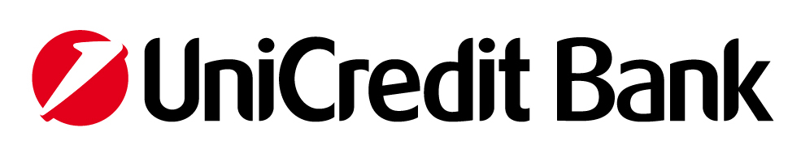

Connector to API of Unicredit Bank - for Common Banking Operations
==================================================================

*Note: Contact me if you need help. I programmed both sides - the Unicredit API as well as this library.*

The internet banking of Unicredit offers the possibility to connect to its API 
from an external program and perform usual banking operations: send money, check actual balance, ...

The API is called [BusinessNet Connect](https://www.unicreditbank.sk/sk/velke-firmy/cash-management/elektronicke-bankovnictvo.html#businessnet) and is available in Unicredit SK, CZ, SI, UA, RO and RU.
(The feature may be not publicly offered in all countries however the bank may provide it on your request. Countries with official support and documentation: SK, CZ.)

This library was tested against Unicredit SK.

It provides API for:

 - payments (domestic payments, foreign payments, sepa, ...)
 - reading actual balance
 - reading payment history

This library supports payments and balance. The payment history is not currently supported. (feel free to add the support)

The Unicredit API
=================

In order to use the [Unicredit API](https://www.unicreditbank.sk/content/dam/cee2020-pws-sk/en-documents/cash-management/BusinessNet_Connect_Produktovy_list_EN.pdf) one has to purchase this feature. It costs monthly around 8,- EUR. See the [price list](https://www.unicreditbank.sk/content/dam/cee2020-pws-sk/sk-dokumenty/ostatne/cenniky/CENNIK_PODNIKATELIA_01082017_SK.pdf).

For a detailed information please read the [technical document](https://www.unicreditbank.cz/content/dam/cee2020-pws-cz/en-documents/cash-management/BusinessNet_Connect_Integration_document.pdf) provided by the Unicredit bank. Here we provide only a brief description.

The Unicredit interface is a webdav folder (e.g. on address https://sk.unicreditbanking.net/webdav/) - one can mount it as a disk into Windows Explorer, mount it in Linux or open in [Total Commander](http://www.ghisler.com/) with [additional Webdav plugin](http://www.ghisler.com/plugins.htm) (this is the most reliable solution which I strongly recommend).

Payment
-----------
One can upload a file in a specific format containing list of payments (called "package") into a particular folder of the webdav (e.g. `/upload/foreign/Gemini_Format/My_Payment.txt`).
Later one can download a corresponding file (e.g. `/upload/status/My_Payment.txt`) with information about status of the package (currently processed, signed, error, ...).

The package must be signed by GPG otherwise the payments are not processed and must be signed manually in the internet banking (with SMS, certificate or anything else).

The certificate is provided to the customer by purchasing the BusinessNet Connect feature by request.
Additionally the package may be encrypted with public certificate of the Unicredit bank.
(Note: the encryption is not implemented by this library because the communication is performed over HTTPS which is a secure channel anyway.)

The payments are processed immediately after successfull upload of the signed package into the webdav folder.

Formats of the package
----------------------

Unicredit supports multiple formats of the package.
As the Unicredit is not using the same backend for each country the supported formats differ per country.
This library uses Multicash as it is the mostly supported format. 

Note: we tested this library against Unicredit SK. If you have account in different country you should check the supported formats. If the Multicash is not supported you can either contact
me or add the support to this library yourself.

Balance
-----------
The actual balance is provided in files in directory `/balances`. However this library uses (because of historical reasons) the balance found in the last transaction of the payment history. Feel free to fix it.

Payment History
---------------------
The payment history is provided in files in directory `/statements`.

Note: The payment history contains list of transactions since one day before the actual day. If you need real time information you would have to purchase the service [MT942](http://www.unicreditbank.sk/sk/Firmy/Cash-management/Elektronicke-bankovnictvo/Businessnet-professional).

Usage
=======

See examples of the usage in [Example.java](https://github.com/petrsmid/unicredit-connector/blob/master/src/test/java/com/newpecunia/unicredit/Example.java).

The Payment
----------------

	//start the connector
	UnicreditConnector connector = buildConnector();
		
	//create payment - set the account number (or IBAN), bank code (or SWIFT) etc. See examples in Example.java
	ForeignPayment payment = preparePayment(); 

	//Pay!
	connector.uploadForeignPaymentPackage("ref_12345", payment);

What happens under the cover: The connector creates a package file with one payment. The file would be named yyyy-MM-dd_HH-mm-ss_ref_12345.csv. The file is signed by PGP and uploaded into the webdav folder.

The Balance
-------------------

	//start the connector
	UnicreditConnector connector = buildConnector();
		
	BigDecimal balance = connector.getLastBalance();
	//if balance > 1.000.000 =>  you are rich!

What happens under the cover: The connector reads balance from the last statement file. This is because of historical reasons, nowadays it would be probably easier to read it from `/balances`. (Feel free to fix it.) 

The information is not up to date (it is one day behind). If you need realtime information please perform the fix described above or purchase the service [MT942](https://www.unicreditbank.cz/content/dam/cee2020-pws-cz/cz-dokumenty/dokumenty-produkty/sazebniky/Sazebnik_Cor_CZ_04_2015.pdf) provided by the Unicredit and read the data from the "realtime" file.

